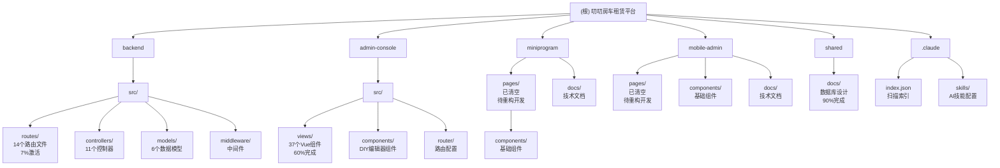

# CLAUDE.md

叨叨房车租赁管理平台 - AI开发助手配置文件

**项目状态**: 🔄 重构启动阶段 - 架构完整，前端页面已清空待重构

## 🎯 项目概述

叨叨房车租赁管理平台是一个全栈房车租赁解决方案，包含：
- **后端API**: Node.js + Express + TypeScript 提供RESTful API
- **PC管理端**: Vue 3 + Element Plus 提供完整管理后台
- **小程序端**: uni-app 3 用户端房车租赁应用
- **移动管理端**: uni-app 3 现场工作人员管理应用

### 技术栈
- **后端**: Node.js 18.18.0 + Express.js 4.18.2 + TypeScript 5.1.6 + Sequelize 6.32.1
- **PC管理端**: Vue 3.5.0 + Vite 4.4.9 + Element Plus 2.11.7 + TypeScript 5.1.6
- **小程序端**: uni-app 3 + Vue 3 + TypeScript 5.1.6
- **移动管理端**: uni-app 3 + Vue 3 + TypeScript 5.1.6
- **数据库**: MySQL 8.0.35 + Redis 7.2.3 (Docker)

### 当前开发进度
- **后端API**: 70% (基础架构完整，需激活14个路由文件)
- **PC管理端**: 60% (37个组件完成，需API对接)
- **小程序端**: 5% (页面已清空，待重构开发)
- **移动管理端**: 5% (页面已清空，待重构开发)

## 📁 项目结构图



## 🏗️ 模块索引

| 模块 | 路径 | 技术栈 | 状态 | 完成度 | 负责功能 |
|------|------|--------|------|--------|----------|
| 后端API | `backend/` | Node.js + Express + TS | 🔄 开发中 | 70% | RESTful API服务 |
| PC管理端 | `admin-console/` | Vue 3 + Element Plus | 🔄 开发中 | 60% | 管理后台界面 |
| 小程序端 | `miniprogram/` | uni-app 3 + Vue 3 | 🔄 重构中 | 5% | 用户端应用 |
| 移动管理端 | `mobile-admin/` | uni-app 3 + Vue 3 | 🔄 重构中 | 5% | 现场管理应用 |
| 共享模块 | `shared/` | 文档 | ✅ 稳定 | 90% | 数据库设计文档 |

## 🚀 核心功能模块

### 用户管理
- 用户注册、登录、认证
- 用户档案管理
- 权限角色管理

### 车辆管理
- 车辆品牌、型号管理
- 车辆状态跟踪
- 车辆维护管理

### 订单管理
- 租赁订单流程
- 订单状态跟踪
- 订单统计报表

### 支付管理
- 多渠道支付集成
- 押金管理
- 退款处理

### 营销管理
- 优惠券系统
- 评价管理
- 收藏功能

### DIY页面管理
- 可视化页面编辑器
- 模板管理
- 组件库

## 🔧 开发环境配置

### 快速启动
```bash
# 1. 启动数据库服务
docker compose up -d mysql redis

# 2. 启动后端开发服务器
cd backend && npm run dev  # 端口3000/3001

# 3. 启动PC管理后台
cd admin-console && npm run dev  # 端口5173

# 4. 小程序开发
# 使用HBuilderX打开 miniprogram/ 目录
# 运行到微信开发者工具

# 5. 移动管理端开发
# 使用HBuilderX打开 mobile-admin/ 目录
```

### 服务端口配置
- **后端API**: 3000 (基础) / 3001 (开发)
- **PC管理后台**: 5173
- **MySQL**: 3306
- **Redis**: 6379
- **Adminer**: 8080 (数据库管理)

### 数据库连接
```
Host: localhost:3306
Database: daodao
Username: daodao_dev
Password: daodao_dev_2024
```

## ⚡ 当前开发重点

### Phase 1: 后端API激活 (本周)
1. **激活路由**: 将14个路由文件集成到主应用
2. **完善控制器**: 实现业务逻辑
3. **API测试**: 确保接口可正常访问

### Phase 2: 前端重构开发 (下周)
1. **小程序重构**: 基于文档重新开发32个页面
   - 🚨 **强制规则**: 阅读技术栈文档和产品需求文档后再开发
   - 🚨 **进度跟踪**: 每完成功能必须更新实施计划和API文档状态
2. **移动端重构**: 重新开发5个管理页面
   - 🚨 **强制规则**: 遵循与小程序端相同的开发流程
3. **管理后台对接**: 完成API对接

### Phase 3: 功能联调完善 (后续)
1. **前后端联调**: API接口对接测试
2. **权限系统**: 分端权限控制
3. **数据完善**: 业务逻辑优化

## 🛠️ 开发规范

### 核心工作流程
1. **研究阶段**: 检查现有代码库，理解项目架构
2. **计划阶段**: 制定实施方案，获得用户确认
3. **实现阶段**: 遵循项目代码风格，完整实现

### 质量红线
- ✅ ESLint零警告零错误
- ✅ TypeScript类型检查通过
- ✅ 所有测试必须通过
- ✅ 完整的错误处理
- ✅ 代码格式化完成

### Git规范
- `feat`: 新功能
- `fix`: 修复bug
- `docs`: 文档更新
- `refactor`: 代码重构
- `test`: 测试相关
- `chore`: 构建/工具相关

## 📋 快速检查清单

### 开发前检查
- [ ] 数据库服务已启动 (MySQL + Redis)
- [ ] 后端开发服务器运行中
- [ ] 前端开发环境配置完成
- [ ] 相关技术文档已查阅

### 代码提交前
- [ ] TypeScript编译无错误
- [ ] ESLint检查通过
- [ ] 功能测试验证
- [ ] API接口文档更新
- [ ] 代码格式化完成

## 🔍 问题解决流程

1. **停止** - 不要猜测或假设
2. **研究** - 检查现有代码库类似实现
3. **搜索** - 联网查找官方文档和最佳实践
4. **提问** - 向用户确认需求和方案
5. **计划** - 制定详细实施方案
6. **实现** - 执行并验证

## 📞 技术支持

### 常用命令
```bash
# 开发服务器启动
cd backend && npm run dev
cd admin-console && npm run dev

# 数据库服务
docker compose up -d mysql redis
docker compose down

# 代码质量检查
npm run lint
npm run format
npm run type-check

# 测试
npm test
npm run test:coverage
```

### 关键原则
1. **先研究、后计划、再实现**
2. **不确定时联网搜索**
3. **严格遵循项目现有风格**
4. **测试必须通过才能提交**
5. **优先激活现有代码而非重新开发**

---

**版本**: v4.0 | **更新**: 2025-11-26 22:15 | **基于**: 实际代码分析

**核心变更**:
- 重新梳理项目当前状态
- 添加模块结构图和导航
- 强调API激活的优先级
- 明确前端重构任务
- 提供完整开发指导