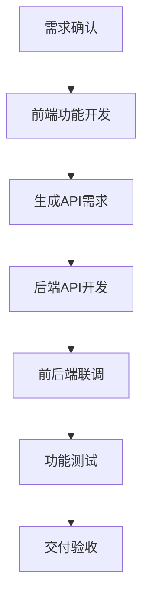
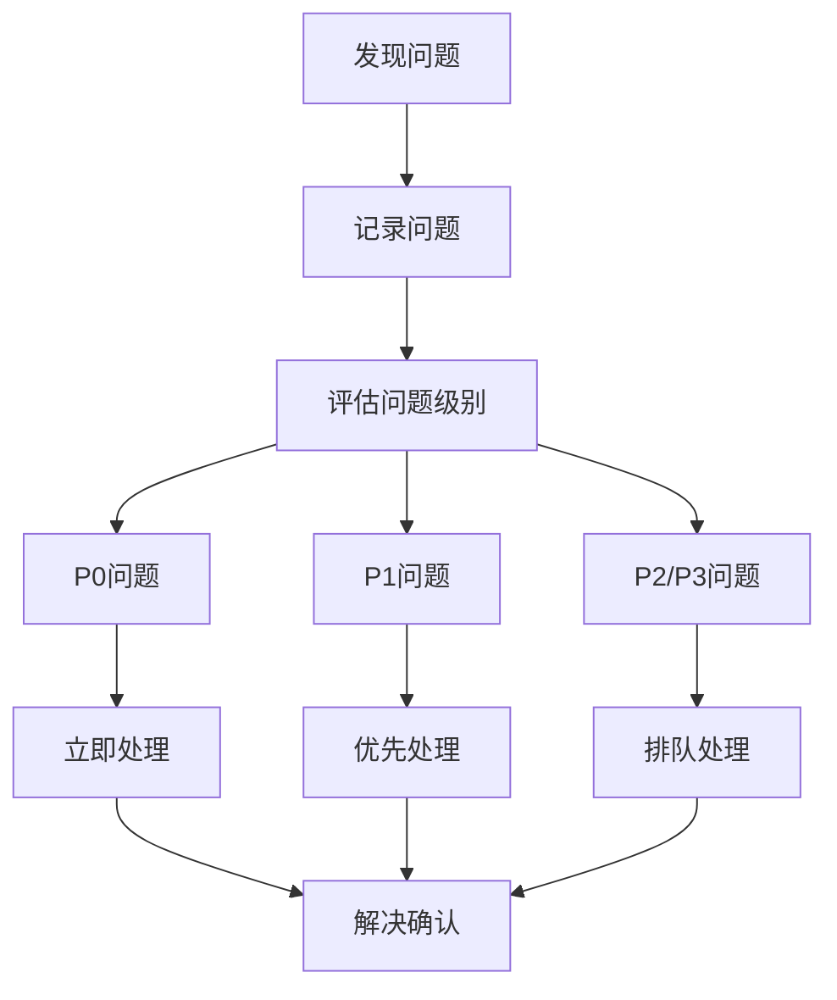

# 叨叨房车项目API状态跟踪文档

**文档版本**: v1.0 | **创建时间**: 2025-11-18 | **维护者**: 叨叨房车技术团队

**文档类型**: API开发状态跟踪和协同工作流程管理

---

## 📋 文档说明

本文档用于跟踪叨叨房车项目各端API的开发状态，协调前后端开发进度，确保项目按计划推进。

**适用范围**：
- 小程序端 (miniprogram/)
- PC管理端 (admin-console/)
- 移动管理端 (mobile-admin/)
- 后端API (backend/)

---

## 📋 目录

1. [API开发状态跟踪](#1-api开发状态跟踪)
2. [协同工作流程](#2-协同工作流程)
3. [状态更新机制](#3-状态更新机制)
4. [问题处理流程](#4-问题处理流程)
5. [里程碑管理](#5-里程碑管理)

---

## 1. API开发状态跟踪

### 1.1 状态维度定义

每个API都有4个维度的状态跟踪：

| 维度 | 状态选项 | 说明 |
|------|----------|------|
| **前端状态** | 未开始 | 尚未开始开发 |
| | 开发中 | 正在开发功能 |
| | 已开发完成 | 功能开发完成，可以联调 |
| **后端状态** | 待开发 | 收到需求，尚未开始 |
| | 开发中 | 正在开发API接口 |
| | 已开发完成 | API开发完成，可以测试 |
| **联调状态** | 待联调 | 前后端都已完成，等待联调 |
| | 联调中 | 正在进行前后端联调 |
| | 联调成功 | 联调测试通过 |
| | 联调失败 | 联调发现问题，需要修复 |
| **测试状态** | 待测试 | 联调成功，等待测试 |
| | 测试中 | 正在进行功能测试 |
| | 测试通过 | 测试完成，功能正常 |
| | 测试失败 | 测试发现问题，需要修复 |

### 1.2 API状态跟踪表

#### 1.2.1 用户认证相关API

| API名称 | 接口路径 | 前端状态 | 后端状态 | 联调状态 | 测试状态 | 负责人 | 最后更新 |
|---------|----------|----------|----------|----------|----------|--------|----------|
| 用户登录 | POST /api/v1/auth/login | ✅ 已开发完成 | ✅ 已开发完成 | ✅ 联调成功 | ✅ 测试通过 | UI设计专家 | 2025-11-18 |
| 用户注册 | POST /api/v1/auth/register | 🔄 开发中 | ⏳ 待开发 | ⏳ 待联调 | ⏳ 待测试 | 小程序端专家 | 2025-11-18 |
| 刷新Token | POST /api/v1/auth/refresh | ⏳ 未开始 | ⏳ 待开发 | ⏳ 待联调 | ⏳ 待测试 | PC端专家 | 2025-11-18 |
| 用户登出 | POST /api/v1/auth/logout | ⏳ 未开始 | ⏳ 待开发 | ⏳ 待联调 | ⏳ 待测试 | 移动端专家 | 2025-11-18 |

#### 1.2.2 用户管理相关API

| API名称 | 接口路径 | 前端状态 | 后端状态 | 联调状态 | 测试状态 | 负责人 | 最后更新 |
|---------|----------|----------|----------|----------|----------|--------|----------|
| 获取用户信息 | GET /api/v1/users/profile | ✅ 已开发完成 | 🔄 开发中 | ⏳ 待联调 | ⏳ 待测试 | 小程序端专家 | 2025-11-18 |
| 更新用户信息 | PUT /api/v1/users/profile | 🔄 开发中 | ⏳ 待开发 | ⏳ 待联调 | ⏳ 待测试 | 移动端专家 | 2025-11-18 |
| 上传头像 | POST /api/v1/users/avatar | ⏳ 未开始 | ⏳ 待开发 | ⏳ 待联调 | ⏳ 待测试 | PC端专家 | 2025-11-18 |
| 常用人管理 | GET /api/v1/users/contacts | ⏳ 未开始 | ⏳ 待开发 | ⏳ 待联调 | ⏳ 待测试 | 后端API专家 | 2025-11-18 |

#### 1.2.3 车辆管理相关API

| API名称 | 接口路径 | 前端状态 | 后端状态 | 联调状态 | 测试状态 | 负责人 | 最后更新 |
|---------|----------|----------|----------|----------|----------|--------|----------|
| 获取车辆列表 | GET /api/v1/vehicles | ✅ 已开发完成 | 🔄 开发中 | ⏳ 待联调 | ⏳ 待测试 | 小程序端专家 | 2025-11-18 |
| 获取车辆详情 | GET /api/v1/vehicles/{id} | ✅ 已开发完成 | 🔄 开发中 | ⏳ 待联调 | ⏳ 待测试 | PC端专家 | 2025-11-18 |
| 创建车辆 | POST /api/v1/vehicles | ⏳ 未开始 | ⏳ 待开发 | ⏳ 待联调 | ⏳ 待测试 | 移动端专家 | 2025-11-18 |
| 更新车辆状态 | PUT /api/v1/vehicles/{id}/status | ⏳ 未开始 | ⏳ 待开发 | ⏳ 待联调 | ⏳ 待测试 | 后端API专家 | 2025-11-18 |
| 车辆筛选查询 | POST /api/v1/vehicles/search | 🔄 开发中 | ⏳ 待开发 | ⏳ 待联调 | ⏳ 待测试 | 小程序端专家 | 2025-11-18 |
| 车辆收藏操作 | POST /api/v1/vehicles/{id}/favorite | 🔄 开发中 | ⏳ 待开发 | ⏳ 待联调 | ⏳ 待测试 | 小程序端专家 | 2025-11-18 |

#### 1.2.4 订单管理相关API

| API名称 | 接口路径 | 前端状态 | 后端状态 | 联调状态 | 测试状态 | 负责人 | 最后更新 |
|---------|----------|----------|----------|----------|----------|--------|----------|
| 创建订单 | POST /api/v1/orders | 🔄 开发中 | ⏳ 待开发 | ⏳ 待联调 | ⏳ 待测试 | 小程序端专家 | 2025-11-18 |
| 获取订单列表 | GET /api/v1/orders | ✅ 已开发完成 | 🔄 开发中 | ⏳ 待联调 | ⏳ 待测试 | PC端专家 | 2025-11-18 |
| 确认订单 | PUT /api/v1/orders/{id}/confirm | ⏳ 未开始 | ⏳ 待开发 | ⏳ 待联调 | ⏳ 待测试 | 移动端专家 | 2025-11-18 |
| 取消订单 | PUT /api/v1/orders/{id}/cancel | ⏳ 未开始 | ⏳ 待开发 | ⏳ 待联调 | ⏳ 待测试 | 后端API专家 | 2025-11-18 |

#### 1.2.5 众筹相关API

| API名称 | 接口路径 | 前端状态 | 后端状态 | 联调状态 | 测试状态 | 负责人 | 最后更新 |
|---------|----------|----------|----------|----------|----------|--------|----------|
| 获取众筹项目列表 | GET /api/v1/crowdfunding/projects | ⏳ 未开始 | ⏳ 待开发 | ⏳ 待联调 | ⏳ 待测试 | 小程序端专家 | 2025-11-18 |
| 获取众筹项目详情 | GET /api/v1/crowdfunding/projects/{id} | ⏳ 未开始 | ⏳ 待开发 | ⏳ 待联调 | ⏳ 待测试 | PC端专家 | 2025-11-18 |
| 获取众筹推荐项目 | GET /api/v1/crowdfunding/projects/recommend | 🔄 开发中 | ⏳ 待开发 | ⏳ 待联调 | ⏳ 待测试 | 小程序端专家 | 2025-11-18 |
| 参与众筹项目 | POST /api/v1/crowdfunding/projects/{id}/join | ⏳ 未开始 | ⏳ 待开发 | ⏳ 待联调 | ⏳ 待测试 | 移动端专家 | 2025-11-18 |
| 获取我的众筹份额 | GET /api/v1/crowdfunding/shares | ⏳ 未开始 | ⏳ 待开发 | ⏳ 待联调 | ⏳ 待测试 | 后端API专家 | 2025-11-18 |

#### 1.2.6 支付相关API

| API名称 | 接口路径 | 前端状态 | 后端状态 | 联调状态 | 测试状态 | 负责人 | 最后更新 |
|---------|----------|----------|----------|----------|----------|--------|----------|
| 创建支付 | POST /api/v1/payments | ⏳ 未开始 | ⏳ 待开发 | ⏳ 待联调 | ⏳ 待测试 | 小程序端专家 | 2025-11-18 |
| 支付回调 | POST /api/v1/payments/callback | ⏳ 未开始 | ⏳ 待开发 | ⏳ 待联调 | ⏳ 待测试 | PC端专家 | 2025-11-18 |
| 申请退款 | POST /api/v1/payments/{id}/refund | ⏳ 未开始 | ⏳ 待开发 | ⏳ 待联调 | ⏳ 待测试 | 移动端专家 | 2025-11-18 |
| 查询支付状态 | GET /api/v1/payments/{id}/status | ⏳ 未开始 | ⏳ 待开发 | ⏳ 待联调 | ⏳ 待测试 | 后端API专家 | 2025-11-18 |

---

## 2. 协同工作流程

### 2.1 标准工作流程



### 2.2 详细流程说明

#### 步骤1: 需求确认 (0.5天)
- **负责人**: UI设计专家
- **工作内容**:
  - 分析功能需求文档
  - 创建页面结构示例图
  - 确认设计方案
- **输出物**: 页面设计示例图

#### 步骤2: 前端功能开发 (2-3天)
- **负责人**: 各端开发专家
- **工作内容**:
  - 制作技术栈指导文档
  - 根据UI设计开发功能
  - 生成Mock数据
- **输出物**: 功能代码 + Mock数据 + API需求文档

#### 步骤3: 后端API开发 (2-3天)
- **负责人**: 后端API开发专家
- **工作内容**:
  - 设计数据库表结构
  - 开发API接口
  - 导入Mock数据
- **输出物**: API接口 + 数据库设计

#### 步骤4: 前后端联调 (0.5-1天)
- **负责人**: 前后端开发专家
- **工作内容**:
  - 替换Mock数据为真实API
  - 测试接口功能
  - 修复联调问题
- **输出物**: 联调测试报告

#### 步骤5: 功能测试 (0.5天)
- **负责人**: 各端开发专家
- **工作内容**:
  - 完整功能测试
  - 异常场景测试
  - 性能测试
- **输出物**: 测试报告

### 2.3 协作原则

1. **并行开发**: 前后端使用Mock数据并行开发，不互相等待
2. **及时沟通**: 遇到问题及时在团队群中沟通
3. **文档驱动**: 所有需求变更必须有文档记录
4. **质量优先**: 每个阶段完成后必须进行自测

---

## 3. 状态更新机制

### 3.1 状态更新触发条件

- **前端状态更新**:
  - 开始开发功能时更新为"开发中"
  - 功能开发完成时更新为"已开发完成"

- **后端状态更新**:
  - 收到API需求时更新为"待开发"
  - 开始开发API时更新为"开发中"
  - API开发完成时更新为"已开发完成"

- **联调状态更新**:
  - 前后端都完成开发时更新为"待联调"
  - 开始联调时更新为"联调中"
  - 联调成功时更新为"联调成功"
  - 发现问题时更新为"联调失败"

- **测试状态更新**:
  - 联调成功时更新为"待测试"
  - 开始测试时更新为"测试中"
  - 测试通过时更新为"测试通过"
  - 发现问题时更新为"测试失败"

### 3.2 状态更新责任人

| 状态维度 | 更新责任人 | 更新时机 |
|----------|------------|----------|
| 前端状态 | 各端开发专家 | 功能开发进度变化时 |
| 后端状态 | 后端API开发专家 | API开发进度变化时 |
| 联调状态 | 各端开发专家 | 前后端联调进度变化时 |
| 测试状态 | 各端开发专家 | 功能测试进度变化时 |

### 3.3 状态更新格式

```markdown
**状态更新记录**

时间：2025-11-18 14:30
更新人：小程序端开发专家
API名称：获取车辆列表
更新内容：
- 前端状态：开发中 → 已开发完成
- 说明：车辆列表页面开发完成，Mock数据已生成

影响：
- 后端状态可以开始开发
- 联调状态可更新为"待联调"
```

---

## 4. 问题处理流程

### 4.1 问题分级

| 级别 | 定义 | 处理时限 | 负责人 |
|------|------|----------|--------|
| P0 | 阻塞性问题，影响项目进度 | 1小时内 | 技术负责人 |
| P1 | 重要问题，影响功能质量 | 4小时内 | 模块负责人 |
| P2 | 一般问题，不影响核心功能 | 1天内 | 开发人员 |
| P3 | 优化建议，改进用户体验 | 1周内 | 开发人员 |

### 4.2 问题处理流程



### 4.3 问题记录模板

```markdown
**问题记录**

问题ID: ISSUE-001
发现时间: 2025-11-18 14:30
发现人: 小程序端开发专家
问题级别: P1
关联API: 获取车辆列表
问题描述:
车辆列表API返回数据格式与前端期望不符

影响范围:
- 小程序端车辆列表功能无法正常使用
- 阻塞相关页面开发进度

解决方案:
1. 后端调整API响应格式
2. 前端更新数据解析逻辑
3. 重新进行联调测试

当前状态: 处理中
预计完成: 2025-11-18 18:00
```

---

## 5. 里程碑管理

### 5.1 项目里程碑

| 里程碑 | 计划时间 | 完成标准 | 当前状态 |
|--------|----------|----------|----------|
| M1: 框架搭建完成 | 第2周末 | 各端框架搭建完成，用户认证功能可用 | ⏳ 进行中 |
| M2: 核心功能完成 | 第8周末 | 房车租赁、订单管理核心功能完成 | ⏳ 未开始 |
| M3: 全功能完成 | 第12周末 | 所有功能开发完成 | ⏳ 未开始 |
| M4: 测试上线完成 | 第14周末 | 测试通过，可以上线 | ⏳ 未开始 |

### 5.2 里程碑评估标准

#### M1: 框架搭建完成
- [ ] 小程序端框架搭建完成
- [ ] PC管理端框架搭建完成
- [ ] 移动管理端框架搭建完成
- [ ] 后端API框架搭建完成
- [ ] 用户认证功能完整可用
- [ ] 基础API接口开发完成

#### M2: 核心功能完成
- [ ] 房车租赁流程完整实现
- [ ] 订单管理功能完成
- [ ] 车辆管理功能完成
- [ ] 用户管理功能完成
- [ ] 支付功能基本实现

#### M3: 全功能完成
- [ ] 所有业务功能开发完成
- [ ] 营销功能实现完成
- [ ] 数据统计功能完成
- [ ] 系统管理功能完成

#### M4: 测试上线完成
- [ ] 所有功能测试通过
- [ ] 性能测试达标
- [ ] 安全测试通过
- [ ] 部署上线完成

### 5.3 风险预警机制

当出现以下情况时，触发风险预警：

1. **进度风险**: 里程碑预计延期超过3天
2. **质量风险**: P0/P1级问题数量超过5个
3. **资源风险**: 关键人员无法正常工作
4. **技术风险**: 遇到无法解决的技术难题

**预警处理**：
- 立即通知项目经理
- 召开风险评估会议
- 制定应对措施
- 更新项目计划

---

## 📊 项目进度概览

### 当前开发进度

- **总体进度**: 15% (框架搭建阶段)
- **已完成API**: 2个
- **开发中API**: 3个
- **待开发API**: 15个

### 各端开发状态

| 端 | 开发进度 | 完成API | 进行中API | 待开发API |
|----|----------|---------|-----------|-----------|
| 小程序端 | 20% | 2 | 1 | 5 |
| PC管理端 | 15% | 1 | 1 | 6 |
| 移动管理端 | 10% | 1 | 1 | 4 |
| 后端API | 15% | 2 | 2 | 6 |

### 本周计划

1. **重点任务**:
   - 完成用户认证API开发
   - 完成车辆列表API开发
   - 开始订单管理API开发

2. **目标**:
   - 新增5个API开发完成
   - 完成3个API的联调测试
   - 解决2个P1级问题

---

**文档维护**: 叨叨房车技术团队
**最后更新**: 2025-11-18
**版本**: v1.0
**下次审核**: 2025-11-25